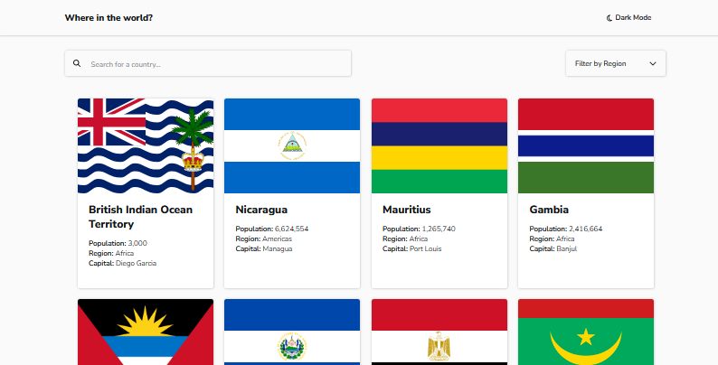
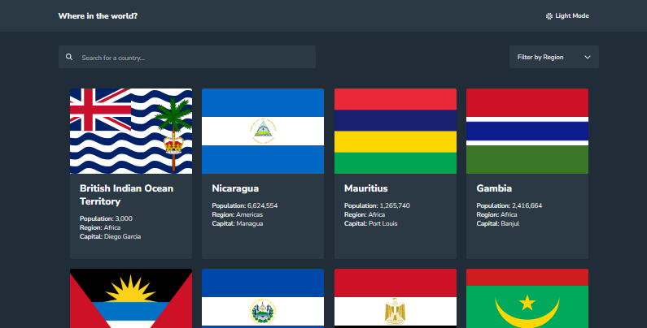
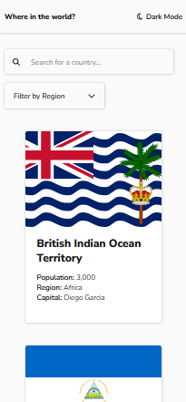
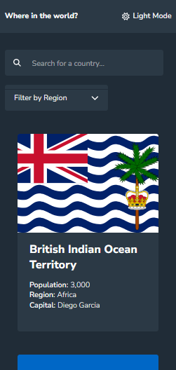
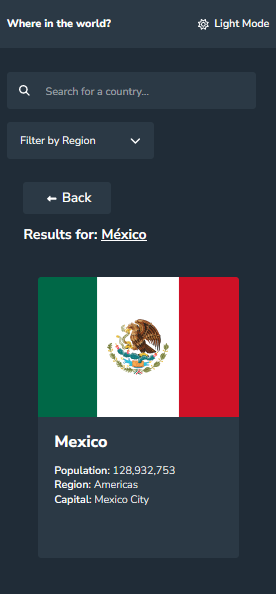
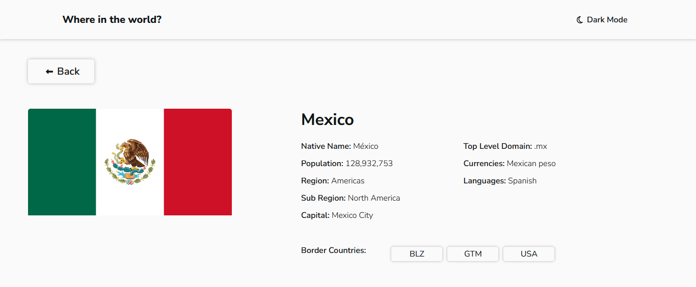
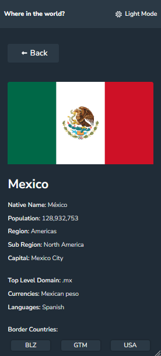

# Frontend Mentor - REST Countries API with color theme switcher solution

This is a solution to the [REST Countries API with color theme switcher challenge on Frontend Mentor](https://www.frontendmentor.io/challenges/rest-countries-api-with-color-theme-switcher-5cacc469fec04111f7b848ca). Frontend Mentor challenges help you improve your coding skills by building realistic projects. 

## Table of contents

- [Overview](#overview)
  - [The challenge](#the-challenge)
  - [Screenshot](#screenshot)
  - [Links](#links)
- [My process](#my-process)
  - [Built with](#built-with)
  - [What I learned](#what-i-learned)
  - [Continued development](#continued-development)
  - [Useful resources](#useful-resources)
- [Author](#author)
- [Acknowledgments](#acknowledgments)

## Overview

### The challenge

Users should be able to:

- See all countries from the API on the homepage
- Search for a country using an `input` field
- Filter countries by region
- Click on a country to see more detailed information on a separate page
- Click through to the border countries on the detail page
- Toggle the color scheme between light and dark mode *(optional)*

## Screenshot

### Home Page Desktop
#### Light Mode

#### Dark Mode

### Home Page Mobile
#### Light Mode

#### Dark Mode

### Search Mobile

### Deatils
#### Desktop

#### Mobile

### Links

- Solution URL: [Frontend Mentor Solution]([https://your-solution-url.com](https://www.frontendmentor.io/solutions/frontend-mentor-rest-countries-api-with-color-theme-switcher-AYSwMqR--A))
- Live Site URL: [Demo](https://juanblancodev.github.io/api-countries-with-color-theme)

## My process

### Built with

- Semantic HTML5 markup
- CSS custom properties
- Flexbox
- CSS Grid
- Mobile-first workflow
- [React](https://reactjs.org/) - JS library
- [React Router DOM](https://reactrouter.com/en/main) - For Routes
- [Axios](https://axios-http.com/es/docs/intro) - To consult the API
- [Styled Components](https://styled-components.com/) - For styles

### Continued development

I would like to continue learning and improving in the use of contexts. I feel like sometimes I don't make the code as clear as possible.

## Author

- Github - [JuanBlancodev](https://github.com/JuanBlancodev)
- Frontend Mentor - [@JuanBlanodev](https://www.frontendmentor.io/profile/JuanBlancodev)
